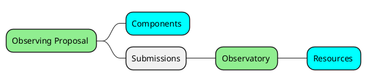
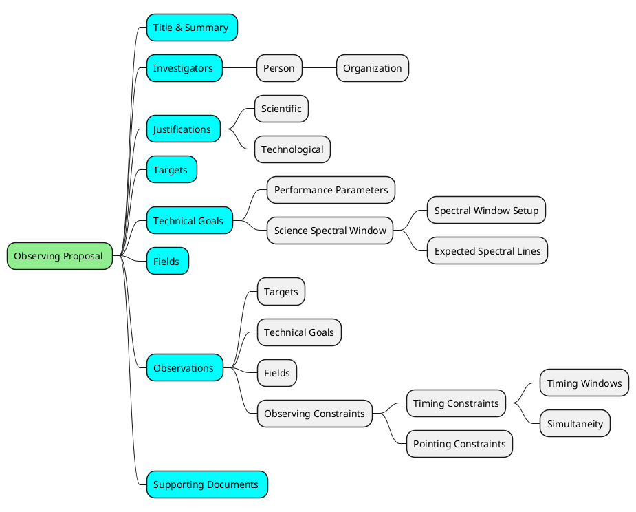
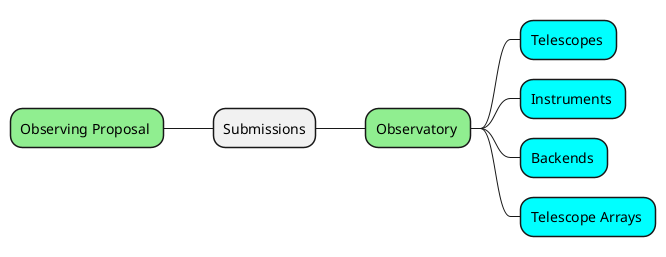

## *High Level View*

```plantuml
@startmindmap
<style>
mindmapDiagram {
.lightgreen {
BackgroundColor lightgreen
}
.aqua{
BackgroundColor aqua
}
}
</style>
* Observing Proposal <<lightgreen>>
** Components <<aqua>>
** Submissions
*** Observatory <<lightgreen>>
**** Resources <<aqua>>

@endmindmap
```
## *Observing Proposal Detail*

```plantuml
@startmindmap
<style>
mindmapDiagram {
.lightgreen {
BackgroundColor lightgreen
}
.aqua{
BackgroundColor aqua
}
}
</style>
* Observing Proposal <<lightgreen>>
** Title & Summary <<aqua>>
** Investigators <<aqua>>
*** Person
**** Organization
** Justifications <<aqua>>
*** Scientific
*** Technological
** Targets <<aqua>>
** Technical Goals <<aqua>>
*** Performance Parameters
*** Science Spectral Window
**** Spectral Window Setup
**** Expected Spectral Lines
** Fields <<aqua>>
** Observations <<aqua>>
*** Targets
*** Technical Goals
*** Fields
*** Observing Constraints
**** Timing Constraints
***** Timing Windows
***** Simultaneity
**** Pointing Constraints
** Supporting Documents <<aqua>>
@endmindmap
```
## *Observatory Detail*

```plantuml
@startmindmap
<style>
mindmapDiagram {
.lightgreen {
BackgroundColor lightgreen
}
.aqua{
BackgroundColor aqua
}
}
</style>
* Observing Proposal <<lightgreen>>
** Submissions
*** Observatory <<lightgreen>>
**** Telescopes <<aqua>>
**** Instruments <<aqua>>
**** Backends <<aqua>>
**** Telescope Arrays <<aqua>>
@endmindmap
```